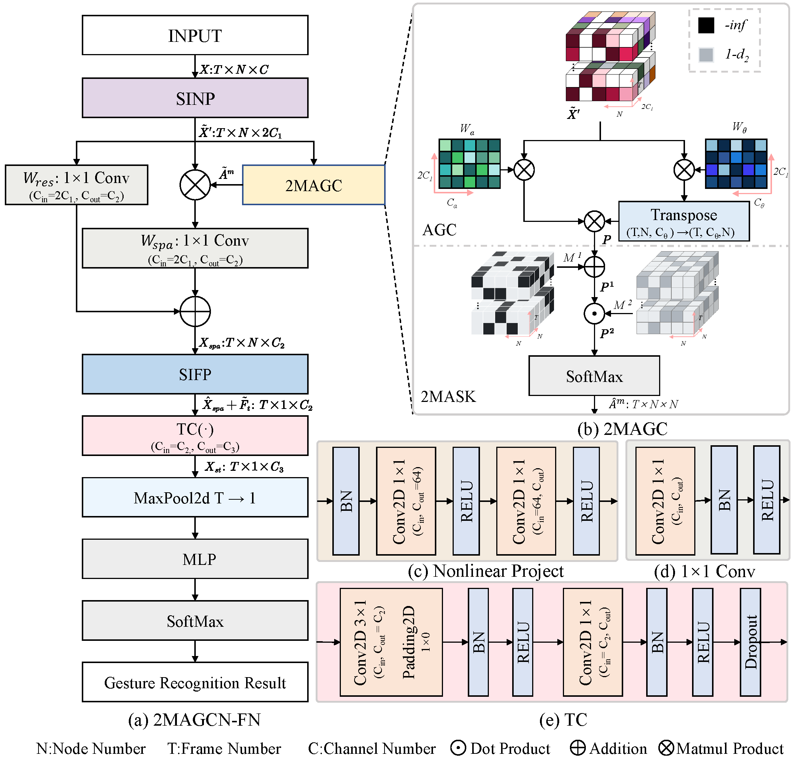

# 2MAGCN-FS
This repo is the official implementation for "An Efficient Gesture Recognition for HCI Based on Semantics-Guided GCNs and Adaptive Regularization Graphs"

Note:  We also provide a strong model, which shows that the average inference time on raspberry pi 4b is less than 4 ms. Extensive testing on the dataset indicates that the proposed method outperforms previous state-of-the-art (SOTA) methods on multiple metrics. Experiments in the simulation environment show that our method meets the high-precision and real-time requirements for autonomous taxiing of UAVs.
## Architecture of 2MAGCN-FS


# Prerequisites

- Python >= 3.6
- PyTorch >= 1.1.0
- PyYAML, tqdm, tensorboardX
- We provide the dependency file of our experimental environment, you can install all dependencies by creating a new anaconda virtual environment and running pip install -r requirements.txt 

# Data Preparation


1.Request dataset here: https://archive.ics.uci.edu/dataset/256/daily+and+sports+activities


2.Download the skeleton-only datasets:


   Ⅰ.daily+and +sports+activities.zip (DSADS)

   Ⅱ.Extract above files to daily+and +sports+activities

# Data Processing

## Directory Structure

```
- daily+and +sports+activities/
  - ddata/
    - a01
    - a02
      ...
    - a19 # raw data of NW-UCLA

```

## Generating Data

- Generate train and test dataset:

```
 # Modify the input and output data paths on lines 46 to 48.
 cd ./UCIdata
 # Run the Python script to generate the training and testing datasets.
 python UCI.py
```


# Training & Testing

## Pretrained Models

Download pretrained models for producing the final results [[Google Drive]](https://drive.google.com/drive/folders/1YI-4TdKMhfesqc1alfhbV0POiQqKf9A3?usp=sharing). .

## Train

- Change the config file depending on what you want.

```python train.py -config config/UCI.yaml ```

## TEST

- To test the trained models saved in <work_dir>, run the following command:

```python train.py -config config/UCI.yaml -eval True -pre_trained_model xxx.pt```


# License

The source codes including the checkpoint can be freely used for research and education only. Any commercial use should get formal permission from the principal investigator (dlh@mail.nwpu.edu.cn).

# Acknowledgement

This repository is built upon SGN.
